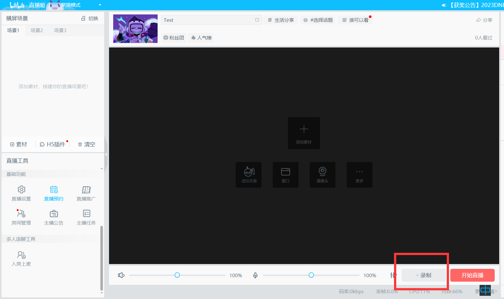
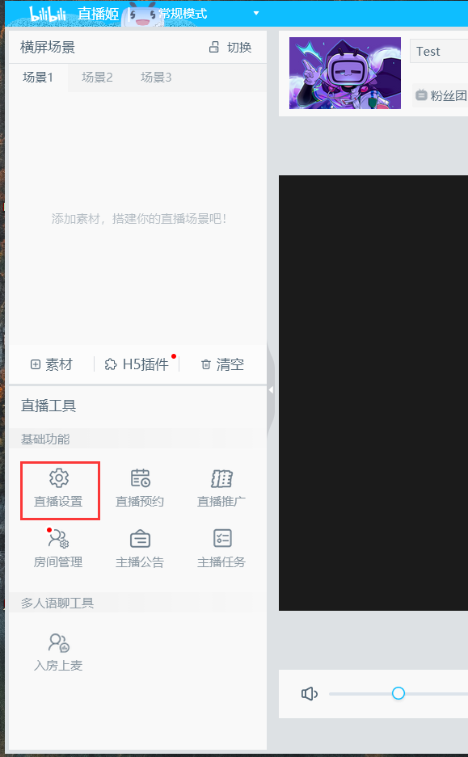
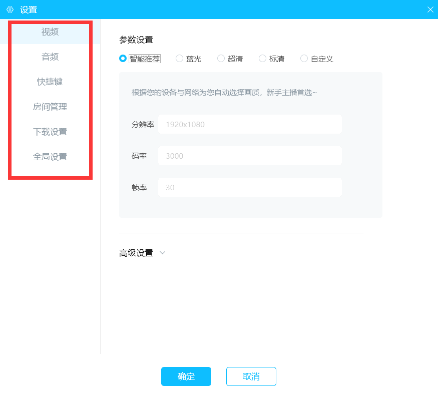
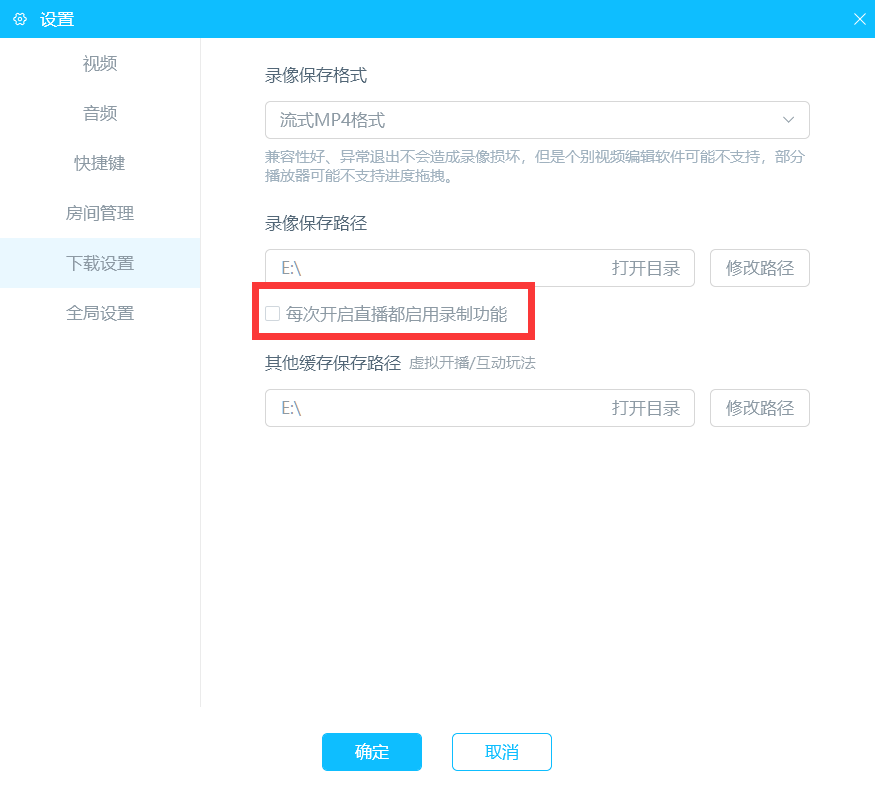
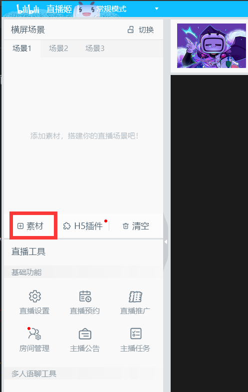
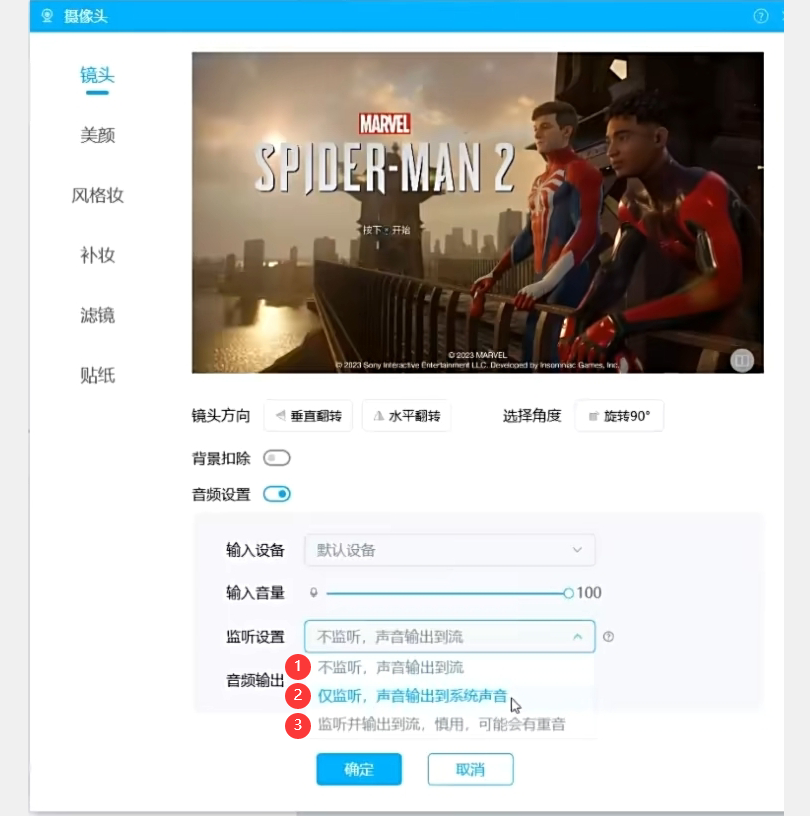
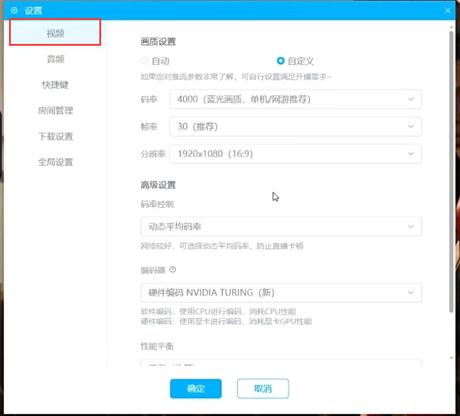
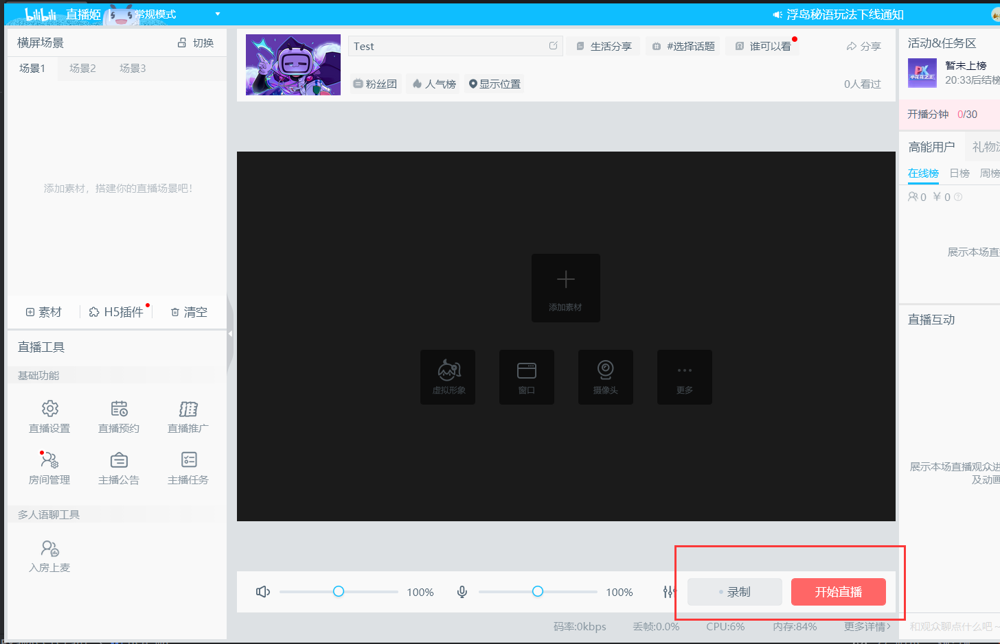

# "直播姬"の簡単な使い方です

**警告**：この記事はChatGPTにより翻訳されており、翻訳結果が正しいかどうかは保証できません。\
**「直播姬」** は **liveHime**とも呼ばれ、BiliBili社の公式ソフトです。

# ライブ（配信）の記録をどう保存しますか
## 簡単な使い方です

上の図で、右側の赤い枠内のボタンがビデオ録画ボタンです。再度クリックすると録画が停止します。\
## ビデオの保存場所の設定
ソフトウェアの左下に，“直播工具(ライブ配信ツール)”-> “基础功能(基本機能)”->“直播设置(ライブ配信設定)”，それをクリックすると設定できます。\
 

上図では、左側に一連の設定が表示され、重要な機能を紹介します。\
\
「下载设置(ダウンロード設定)」には、ビデオ録画のフォーマットに関する一連の設定があります。以下のようになります：\

第一の選択ボックスは録画フォーマット、第二の選択ボックスは保存場所、次に、各ライブ配信でデフォルトで録画を開始するかを選択するチェックボックスがあり、最後の選択ボックスはその他のキャッシュ位置に関するものです。\
## PS5の録画方法
"素材"をクリックします。\

「摄像头(カメラ)」を選択します。\
\
\
図の中で、①はキャプチャカードの選択、②は解像度の選択です。\
\
上の図では、コンピューターでキャプチャカードからの音声を再生しない場合は①を選択し、コンピューターでキャプチャカードからの音声を再生したい場合は②を選択します。\
\
音声出力に関して、「输出到推流(ストリームに出力)」「通过DirectSound(DirectSound経由で)」「通过WaveOut(WaveOut経由で)」という選択肢がありますが、ここでは最初の選択肢を選択してください。\
\
その後、メイン画面の左下にある「直播设置(ライブ設定)」を再選択すると、出力するビデオのパラメータを選択できます。\

そうすれば、メイン画面の右下で録画やライブ配信ができますね！成功を祈ります！\

