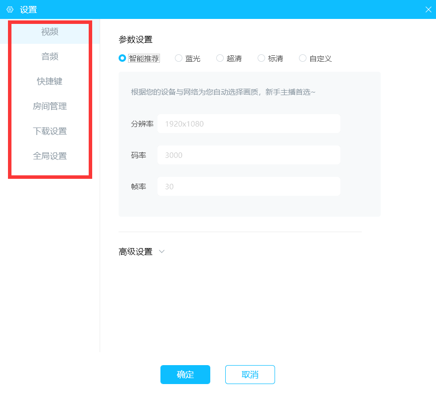
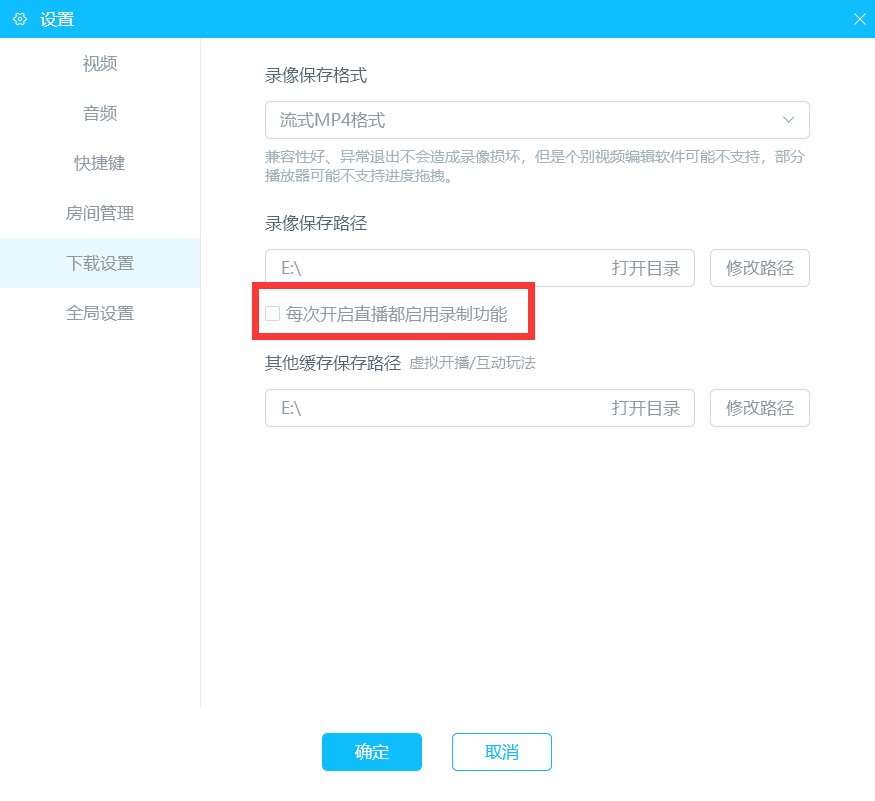
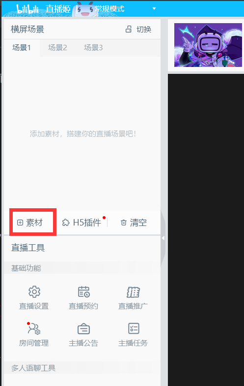
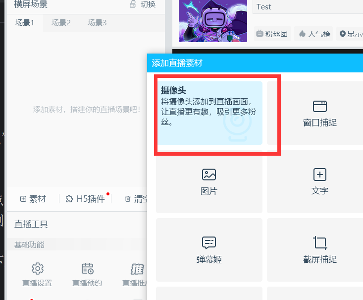
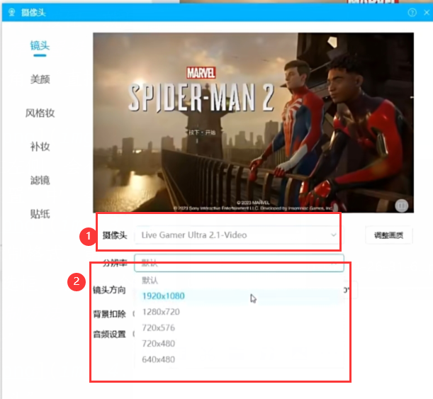
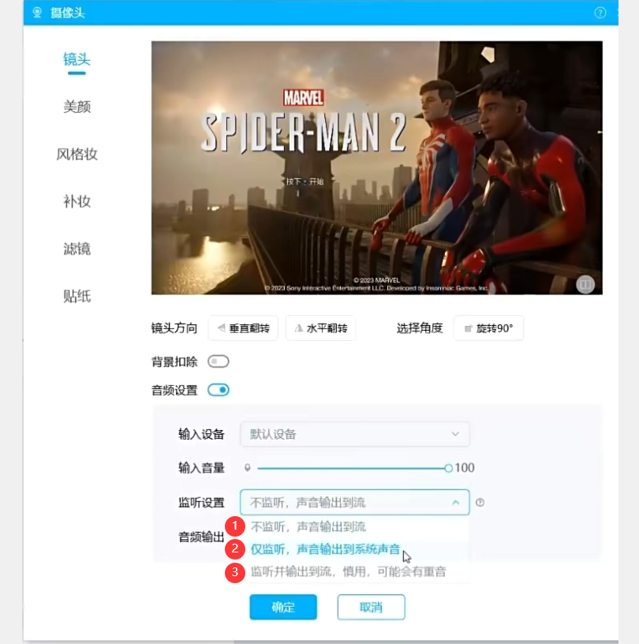
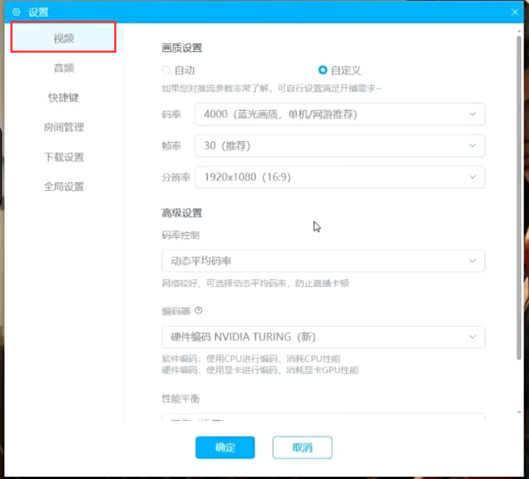

# 直播姬的简单使用方法
这里“直播姬”也可叫做 **liveHime**，它是BiliBili公司的官方软件。

# How to save records of videos
## 简单使用方法

右侧红色框内的按钮，就是录制，再次点击，即为结束录制。
## 视频保存位置设置
在软件左下角，“直播工具”-> “基础功能”->“直播设置”中，点击即可设置。

上图中，在左侧，会有一系列设置，我将重点介绍部分功能。 
在“下载设置”中，会有一系列关于视频录制的格式，如下图：

第一个是录制格式，第二个是保存位置，接下来是一个关于每次直播默认开启录制的勾选框，最后一个是其他缓存位置。

## PS5录制方法
点击“素材”

选择“摄像头”

上图中，①是选择采集卡，②是选择分辨率

上图中，如果不需要电脑播放采集卡的声音，可以选择①，如果你想要电脑播放采集卡的声音，选择②\
至于音频输出，有“输出到推流”“通过DirectSound”“通过WaveOut”，这里选择第一个即可。\
然后，在主界面左下角，再次选择“直播设置”中，可以选择输出的视频参数。\

这样就可以在主界面右下角录制和直播了！
